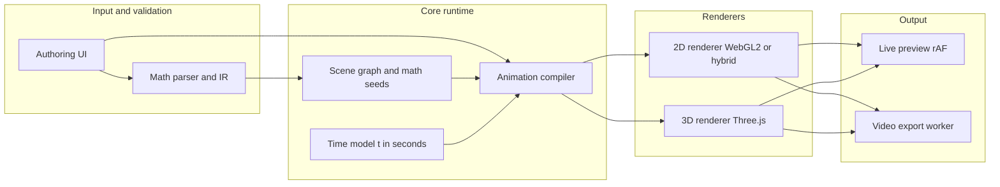

# Cinematic Math Visualization Platform (Web)

## What we cannot do from the attachment alone

The path you shared points to a local **MP4**; in this environment the file is **not readable as text** and **playback/analysis of pixels is not available**, and the on-disk path did not resolve in the sandbox. To mirror *your* recording precisely (typography, palette, shot rhythm), add **2–3 screenshots** or a **15–30s description of shot order** in a follow-up; until then, the “reference analysis” below reflects **common patterns in high-end explainer / motion-graphics** plus your stated goals.

## What makes this kind of piece visually compelling (generic “pro editor” read)

- **Read order and hierarchy**: One primary focus at a time (expression vs plot vs legend), with secondary elements dimmed, blurred, or scaled down. Motion follows **attention**: camera and emphasis align with the narrative beat.
- **Pacing on beats, not on frames**: Cuts, holds, and accelerations feel intentional. Professional timelines use **easing** (ease in/out, overshoot selectively) and **holds** (static frames that let viewers absorb symbols).
- **Camera as narrator**: Zoom/pan is not “navigation”; it is **rhetoric**—e.g. punch-in on a term before revealing its geometric meaning, or a slow dolly to align a curve with a label.
- **Restraint in style**: A tight palette, consistent grid, generous negative space, and crisp type give “premium” more than extra effects. Gradients, blur, and shadows are used sparingly and consistently.
- **Build structure**: Titles/sections → define objects → show relationships → conclusion. The math “unfolds” as **staged layers** (opacity, stroke draw, step-wise substitutions), similar to well-edited B-roll.

Your product’s core idea is to encode those beats as **data** (scene + timeline), not as ad-hoc component state.

## Product concept (one sentence)

A **declarative scene** (math objects + layout + styling) plus a **deterministic, time-based story** (keyframes, tracks, easing) rendered by a **real-time engine**; the same time model is reused for **frame-perfect export**.

## Proposed system architecture

### 1) Math layer: from text to “things we can film”

- **Input surfaces**: Text field with **LaTeX-style** syntax for display; a separate **computation** syntax (e.g. function bodies, param ranges) to avoid overloading one parser. Consider **MathJSON**-like intermediate representation for transforms (substitution, simplification) if you add “story steps.”
- **Parsing/evaluation**:
  - **Numeric evaluation and sampling** for animation: [mathjs](https://mathjs.org/) (expressions, matrices, some symbolic steps) and/or a small, auditable [expr-eval](https://github.com/stevejburrows/eval) subset for hot paths.
  - **2D/3D curve generation** by sampling (adaptive for curvature if needed) into polylines/meshes. Store **lazy generators** (seed + params) and cache samples per time window in workers.
- **IR outputs**: `Function1D/2D`, `ParametricCurve`, `ImplicitRegion` (marching squares later), `VectorField` (optional), `Label/Annotation` (anchors to math objects).

### 2) Scene graph: what exists on the canvas

- Nodes: `Camera2D/3D`, `EquationStrip`, `PlotLayer`, `Highlight`, `Grid`, `TextBlock`, `Callout`, `Mask`.
- Each node has **style tokens** (palette, type scale) and **animatable properties** (opacity, position, weight, line phase, focus blur).

### 3) Animation engine: “video editor” semantics without replicating an NLE

Implement a small **compositor** instead of a full NLE in v1:

- **Global clock**: absolute time `t` in seconds, plus optional `duration`, `loop`, `markers`.
- **Tracks**: parallel lanes such as `camera`, `reveal_A`, `emphasis_B`, `audio` (optional later). Each track holds **keyframes** for named properties.
- **Keyframes + interpolation**:
  - **Linear** rare; default to **cubic Bezier** easing (CSS-like) or **spring** (use sparingly; springs are harder to match across export unless simulated deterministically with fixed sub-steps).
- **“Shots” as sequences** (higher level): a shot is a **preset** that expands into keyframe bundles (e.g. `Shot.IntroTitle`, `Shot.RevealFunction`, `Shot.ShowPlot`), editable by users later.

**Critical for your “feels like Resolve/Premiere” bar**: the animation update path must be **pure**—`state = f(t, project)`—no hidden `useEffect` time accumulation that diverges in export.

### 4) Rendering engine: 2D vs 3D and quality

- **Default v1 (fastest to premium 2D)**: **WebGL2** line rendering with good joins/miter, MSAA, and crisp UI via high-DPI backing store; optional **SDF** text if you need zoom clarity.
- **3D (when the story needs surfaces or space)**: **Three.js** for meshes and camera moves; still drive Three cameras from the same `Camera3D` track as the 2D option.
- **Why not only SVG/CSS**: they hit limits on thick stylized lines, many layers, and consistent motion at 60 fps; hybrid is fine: SVG for UI, WebGL for plots.

### 5) “Looks edited,” not “a graph wiggling”

Ship **director primitives**:

- `Focus(targetId, {zoom, margin, hold})`
- `Crossfade` between expression states (symbolic step or numeric morph with constraints)
- `DrawAlong` (stroke progress along curves or equation glyphs—often shader-based for curves)
- `EasingPresets` (cinematic, snappy, floaty) and **default holds** (200–500 ms) after key reveals
- `Safe margins** and **title safe** for video framing

### 6) Both live preview and matching export (your selected priority)

**Single timeline model** is mandatory. Two practical stacks:

- **A) App-native export (keeps one codebase)**
  - Preview: `requestAnimationFrame` drives `f(t)`.
  - Export: run the same `f(t)` in a **fixed-step loop** in a `Worker` with **OffscreenCanvas** (or main thread if size allows), write frames to `VideoEncoder` (WebCodecs) when available, or fall back to **MediaRecorder** over `canvas.captureStream({ fps })` (simpler, less frame-perfect).
  - **Pros**: one renderer. **Cons**: platform codec quirks; WebCodecs availability varies; testing matrix grows.

- **B) Remotion-style separation (extremely strong for export)**
  - Use **[Remotion](https://remotion.dev/)** for deterministic composition if you are willing to center the product on “frames are truth.” The preview site can embed the same composition for pixel-consistent output.
  - **Pros**: export story is first-class, timeline thinking matches video. **Cons**: steeper buy-in; must structure math rendering to work in Remotion’s model.

**Recommendation for “both with matching motion”** without overbuilding: start **A** with a **pure clock** and **offscreen frame pipeline**; add **B** only if you need broadcast-grade, reproducible encodes in v1.

## Suggested tool matrix (opinionated but swappable)

| Concern | Suggestion |
|--------|------------|
| App shell / UI | React + Vite + TypeScript |
| State / animation authoring | Zustand or Jotai for UI; animation data lives in a **versioned project JSON** |
| Easing / tween evaluation | [Popmotion](https://popmotion.io/) (pure numeric) or a tiny in-house bezier solver |
| 2D WebGL | [PixiJS](https://pixijs.com/) (scene graph) + custom plot layer, or raw WebGL2 |
| 3D | [Three.js](https://threejs.org/) with `Orbit` disabled; camera fully scripted |
| LaTeX rendering | [KaTeX](https://katex.org/) to texture or DOM overlay carefully synced to WebGL (watch DPI) |
| Parser/numeric | mathjs + custom grammar for your accepted syntax |
| Tests | property tests for parser; golden **frame hash** tests for export in CI (where feasible) |

## Major risks and mitigations

- **Parser ambiguity / unsafe eval**: no `eval` of raw strings; parse to AST, whitelist functions, cap domains, and surface great errors. Fuzz the parser.
- **Performance**: precompute heavy samples in **Web Workers**; cap plot resolution; debounce reparse; use **OffscreenCanvas** in export; avoid React re-rendering every frame in hot paths.
- **Motion mismatch live vs export**: ban wall-clock in animation; test export at fixed `fps` with identical random seeds (if any); prefer deterministic interpolation.
- **Text sharpness at zoom**: separate UI scale from “camera” scale where possible, or use SDF/vector where zoom is central.
- **3D + crisp lines**: use mesh tubes or line materials with good AA; avoid 1px aliasing in screen recordings by rendering at 2x.

## Phased delivery (outcome-driven)

1. **Milestone 1 – “Director demo”**: parse `f(x)` and `x(t), y(t)`; plot on WebGL; camera track (pan/zoom) + 2–3 shots as presets; 60 s story from JSON; export best-effort WebM.
2. **Milestone 2 – “Authoring”**: on-timeline keyframes, easing UI, layer visibility, text/labels, save/load project files.
3. **Milestone 3 – “Polish and depth”**: symbolic steps (light CAS), 3D scenes, more transitions, stricter **VideoEncoder** export, automated tests.
4. **Milestone 4 – “Distribution”**: templates, sharing, optional server-side render (queue + ffmpeg) if client export is not enough for quality bar.

## Clarification to resolve later (not blocking a start)

- **Exact visual language from your MP4** (font, palette, rhythm): please attach screenshots or a short beat list so Milestone 1 can match the reference, not a generic explainer.
