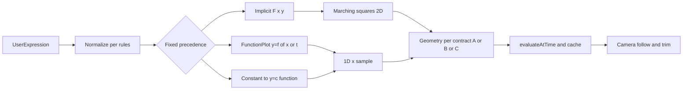

# Multi-mode equation plotting

## Current architecture (relevant)

- **Function-only path today**: [`src/core/math/compileExpr.ts`](src/core/math/compileExpr.ts) whitelists free symbols to `{x, t}` only; any `y` raises `Unknown symbol: y`. The file also uses a name `fnWhitelist` that is **not** “functions only”—it includes operators like `add`, `subtract`, etc. Any classifier reusing the same `assertSafeNode` / parse rules must not assume a functions-only list.
- [`src/core/math/samplePlot.ts`](src/core/math/samplePlot.ts) samples `y = f(x)` in x only.
- **Parametric** already exists in [`src/core/ir.ts`](src/core/ir.ts) (`ParametricPlotDef`) and [`samplePlot`](src/core/math/samplePlot.ts), but [`src/store.ts`](src/store.ts) only mutates `plot.kind === "function"`, and [`src/engine/evaluateProject.ts`](src/engine/evaluateProject.ts) only applies `computeTimelineUnionSampling` to **function** plots. A **single string expression** in the UI will still **not** select parametric without new syntax or extra fields; timeline-union for `u` remains a follow-up in that workstream.

## Geometry contract: one Polyline2D vs multiple contours (blocking)

`Polyline2D` is a single `points` buffer with **monotonic `cumLen` along consecutive vertices** ([`buildCumLen`](src/core/math/samplePlot.ts)). **Naively appending** contour B after contour A makes `buildCumLen` add a long chord from A’s last vertex to B’s first. The renderer, [`tipAtDraw`](src/render/trimPolyline.ts), and `trimPolyline` will treat that chord as real geometry: wrong progressive draw, wrong camera follow, and a **visible stray edge**.

**Choose one before implementing implicit joining:**

- **Option A — Extend the model**  
  e.g. list of `Polyline2D`, or a single buffer plus **break indices** / degenerate-segment skip if the WebGL path can draw multiple sub-strips. Progressive draw and follow operate per strip or in defined sequence without fake edges.

- **Option B — One component for v1**  
  If marching squares returns more than one closed/open component, **fail or clip** to the largest (or first) with a clear user-visible message. Guarantees a single well-behaved polyline and preserves current arclength semantics.

- **Option C — API change**  
  “Concatenate” only in UI/draw order but **not** in one cumulative distance buffer (requires explicit support for discontinuous arclength or multi-path in render state).

Until one of these is specified and implemented, “preserve progressive draw and camera follow” is **not** guaranteed for **multi-loop** implicits. The old plan text that suggested ordering concatenation into one polyline without this contract is **rejected** as unsafe.

**Closed loops**: Decide explicitly whether a closed contour is stored as an **open** polyline (first ≠ last) or with **repeated first point** at the end, since that affects arclength, `draw === 1`, and the last segment in `tipAtDraw`.

## Design decisions

### 1) Single string in the UI, discriminated `plot` in the project

**Fixed precedence (order matters; add tests for each hazard):**

1. **Normalize** (see § Normalization) without destroying intent.
2. **Explicit function** if, after the **only** allowed leading strip of `y =` for explicit mode (see § Normalization), the remainder parses as a single value whose free variables are **exactly** in `{x, t}` (with `t` treated as the abscissa, same as today). *Example: `y = x` must classify here even though the raw string can contain `=`; do not split on that `=` for implicit.*  
3. **Implicit** if a **top-level** `=` is present (see § Top-level `=`) and step (2) did not consume the whole expression as explicit `y = …`. Form **F = left − right** (algebraic equality only; v1: **inequalities** `<`, `>`, `<=`, `>=` are **out of scope** for implicit curves unless explicitly added later with a different pipeline).
4. **Scalar** if, after **substituting `t` → `x`** for the scalar check only (or equivalently, require no `t` in scalar), there are no free variables.

**Implicit without `=`**: Allowing any expression with free `{x, y}` to be implicit (e.g. heart as F=0) risks turning typos into “implicit” plots. v1 options: (a) allow with optional **lint** in UI, or (b) **require** `= 0` or `= <constant>` for implicit—pick one in implementation and test it.

**Algebraic form**: v1 only supports **F(x,y) = 0** obtained by `left − right` for equalities. Sign does not change the curve; arbitrary nonlinear rewrites of `f = g` beyond subtraction are the user’s responsibility.

**F(x,y,t) and animation**: The implicit sampler as `{x, y}` only—**no `t` in F** in v1—means **time-varying** constraints (e.g. moving circle) do **not** match the function-plot / cinematic story unless the IR and sampler are later extended. Call this out as a product gap in docs.

**Compile sandbox**: `compileImplicit` should use `assertSafeNode(node, new Set(["x", "y"]))` in the same spirit as `assertSafeNode(node, FUNCTION_PLOT_VARS)`—*not* a function call with coordinate pairs. For v1, **`t` is not a free variable in implicit F**; reserve extension for a later `t` in scope if product adds time-varying implicits.

### 2) Normalization (`normalizeExpression`)

Document **exact rules** and add regression tests:

- What is stripped, and **only** when (e.g. **leading** `y =` for explicit `y = f(x)` only, not a blind global strip that breaks “implicit with `y` on one side”).
- Interaction with **classification order**: explicit must be decided before **generic** `=` split.

### 3) Top-level `=` splitting (raw string)

- Use parenthesis **depth** and ignore delimiters **inside strings** (if applicable).
- **Pitfall**: `<=`, `>=`, `==` (if they appear after normalization) must **not** be treated as a single `=` for splitting; scan for safe split positions only.
- **Multiple** top-level `=` in one expression: v1 = **error** (invalid/ambiguous) with a clear message.
- Where raw split and **mathjs AST** disagree (e.g. relation nodes), prefer one source of truth and test both paths if both exist.

### 4) Scalar vs `t`

`sin(t)` with no `x` is **not** a scalar: it is the same as a function of the abscissa (alias of `x`). **Rule**: treat as **function** (explicit) after `t` ↔ `x` alignment with existing `compileFunctionPlot` behavior, or require scalar classification **after** normalizing `t` → `x` for the “no free variables” check—define one rule and test `sin(t)` explicitly.

### 5) 2D view bounds and naming (align with WebGL)

The camera stores **horizontal** half-extent as `halfWidth` ([`ResolvedCamera2D`](src/engine/renderState.ts)). The fragment shader path uses `halfH = halfWidth / aspect` for **vertical** world half-height ([`Plot2DWebGL`](src/render/webgl2/Plot2DWebGL.ts)). Any helper like `minViewBottom` / `maxViewTop` should use the **same** relation: at each timeline sample, `y` edges are `centerY ± halfWidth / aspect` (or equivalently `centerY ∓ (halfH)` with **halfH** named consistently—not “minViewBottom from halfWidth” without making the vertical/horizontal roles obvious). Re-verify against `CameraEnvelope2D` fields and document the one-line contract so a half-width vs half-height slip does not get baked in.

`computeTimelineUnionSampling2D`: union of scene bbox (`xMin`/`xMax`/`yMin`/`yMax` on the implicit def) and the camera-driven 2D view rect, then quantize (same spirit as 1D).

### 6) Cell budget and cache key (2D)

- **1D `samples` ≠ 2D segment count**: define an explicit **formula**, e.g. `nx = ny ≈ floor(sqrt(budget))` with a **hard cap** on `nx * ny` (and enforce in tests under large timeline unions).
- **Cache key** must **enumerate** every input that affects the polyline: at minimum `plot.kind`, expression string, cell counts / budget, **quantized** `xMin`/`xMax`/`yMin`/`yMax`, any preview-aspect constant, and timeline-union parameters included in 2D bounds. If `t` is ever added to F, it must be part of the key. Omitting an input risks **stale or jittering** cache hits.

### 7) Implicit rendering: marching squares

- **Isovalue** and tolerance: document default (e.g. 0) and behavior near ambiguous crossings; note **|∇F| ≈ 0** as a known glitch risk for v1.
- **Grid**: fixed grid misses thin features; **adaptive refinement** is out of v1 unless explicitly scheduled—state that.
- **Topology**: after MS, build polylines according to the **Geometry contract** section; do not fabricate inter-component edges.

### 8) `evaluateProject` and caching

Branch for `plot.kind === "implicit"` parallel to `function`, using 2D bounds and the **full** cache key from §6.

### 9) Error reporting: discriminated by kind

Generalize `getFunctionPlotCompileError` into a **single entry** that **switches** on `PlotDefinition.kind` and reads only fields that exist on that variant (`expression` vs `xExpression`/`yExpression` / etc.), so the UI **never** assumes a field name that does not exist on implicit or parametric.

### 10) Director / outro framing

Extend [`computeHeroOutroFraming`](src/director/outroFraming.ts) to the sampled main plot (function or implicit). **Bbox from a grid sample** can **stair-step** and underestimate smooth curves: framing tests and tolerances should use **epsilon** against analytic bounds, not exact algebra.

## Risks / limitations (summary)

- Preview **aspect** vs live **resize** (unchanged: fixed constant vs canvas unless plumbed project-wide).
- **N²** grid cost: hard cap and optional **performance** test that worst-case cell count stays under cap with a large timeline union.
- **Inequalities, time-varying F, adaptive grids**: v1 out of scope unless added above.

## Testing (tightened)

- **Classification**: `y = x` (explicit wins over `=` split); `x^2 + y^2 = 1` (implicit); `3*sin(2*pi)` (scalar/constant); malformed `=`; `<=` / `>=` not mis-split; `sin(t)` (function, not scalar).
- **Multi-component** implicit: behavior per chosen geometry contract (no spurious chord if single polyline is chosen).
- **Sampler**: circle/ellipse—assert **approximate** radius and center with **grid slack**, not exact analytic bbox.
- **Engine**: cache stability when `t` changes but key inputs do not; full key coverage.
- **Integration**: `setExpression` + errors for heart/circle/constant.
- **Optional**: max cell count / perf under cap.

## Data flow (high level)

## What the prior draft still does well (unchanged in spirit)

- 2D **timeline-union** bounds to avoid per-frame wobble, parallel to 1D function policy.
- Preview aspect tradeoff and **N²** cost awareness.
- Same **assertSafeNode**-style compile sandbox.
- Mermaid **pipeline** shape (now gated on explicit geometry and classification order).
