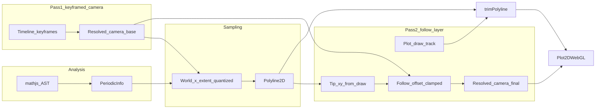

# Periodic, cinematic graph rendering and camera

## Current behavior (baseline)

- Polylines are built once per expression/range in [`src/core/math/samplePlot.ts`](src/core/math/samplePlot.ts) over fixed `xMin`/`xMax` from the scene.
- Progressive reveal is already **arclength-based** via `draw` 0..1 and [`src/render/trimPolyline.ts`](src/render/trimPolyline.ts) ([`evaluateAtTime`](src/engine/evaluateProject.ts) wires this up).
- The WebGL renderer draws the trimmed polyline only ([`Plot2DWebGL`](src/render/webgl2/Plot2DWebGL.ts)).
- Story beats are authored as merged property tracks in [`src/director/shots.ts`](src/director/shots.ts); easing is cubic-bezier via [`src/engine/keyframes.ts`](src/engine/keyframes.ts) + [`src/engine/easing.ts`](src/engine/easing.ts).

**Gap:** Fixed `xMin`/`xMax` guarantees visible **cutoffs** whenever the camera pans/zooms or when a periodic curve should “continue” past the authored window. **Follow** is a fixed pan (`+1.2`, `+0.15`), not tied to the drawn tip. **Reveal easing:** for `draw`, the segment `t0→t1` uses the **first** keyframe’s easing ([`valueAtTime`](src/engine/keyframes.ts)); today that is `linear`, so the cinematic ease on the end key does not affect the main reveal—worth fixing when touching shots.

## Architecture (target data flow)

**Why two passes:** Avoid a circular dependency (extent depends on camera; naive “follow” depends on polyline that depends on extent). **Base camera** from tracks defines the viewport intent; **sampling extent** uses base camera only; **follow** is an additive offset from the sampled tip.

## 1) Periodicity detection (programmatic, heuristic)

Add a small pure module (e.g. [`src/core/math/analyzePeriodicity.ts`](src/core/math/analyzePeriodicity.ts)) that:

- Parses the function expression with the same `mathjs` instance as [`compileExpr.ts`](src/core/math/compileExpr.ts) and walks the AST (no new runtime deps).
- **Class A (supported well):** `sin`, `cos` (and optionally `tan` / `sec` / `csc` / `cot` if present in the whitelist) of an argument that is **affine in `x`** only: `a*x+b` with `a` evaluable to a non-zero number **without** `x` (constant `a`, `b`). Examples: `sin(2*x+1)` → period `2π/|a|`; `tan(a*x)` → `π/|a|`.
- **Explicit exclusions (must NOT be Class A):** `sin(x^2)`, `sin(1/x)`, `sin(abs(x))`, nested `sin(sin(x))`, or any trig whose argument still contains `x` outside a single linear term. These are **unknown / non-periodic** for director pacing (avoid wrong pan lengths).
- **Class B:** Sums/products of Class A terms → combine periods only when ratios are **commensurate within a tight float tolerance** (e.g. after normalizing by a common factor like `π`, test rationality with bounded denominators or GCD on scaled integers). If any pair fails, return **unknown**—do not guess an LCM for e.g. `sin(x)+sin(sqrt(2)*x)` (no exact global period).
- **Otherwise:** non-periodic for this feature’s purposes.

**Out of scope for first iteration unless trivial:** full parametric periodicity (e.g. circles). Follow-up: mirror the same AST scan on `u` for parametric defs.

**Tests:** Vitest cases for `sin(2*x)`, `cos(x)+sin(x)` (commensurate), `sin(x)+sin(pi*x)` (likely unknown or careful rational test), `sin(x^2)`, non-trig polynomials, and sums that must return unknown.

## 2) Loop-aware sampling (no visible cliff for periodic plots)

### Critical design constraint: `draw` is arclength-normalized on the **current** polyline

If `xMin'` / `xMax'` change over time (per-frame from camera), **new vertices can appear at the beginning or middle** of the sampled domain. Because `draw ∈ [0,1]` means “fraction of **total** arclength,” changing the polyline changes the mapping from `draw` to world-space tip position: the curve can **jump, rewind, or change speed** in world space even when `draw` moves smoothly in time. That breaks narrative timing and tip-follow.

**Approved strategies (pick one primary; document in code):**

1. **Timeline-union extent (recommended default):** For a given plot + expression, precompute a single `(xMin', xMax')` that covers **every frame** of the composition: union over discrete export/preview times (or analytic bounds from min/max `centerX ± halfWidth` over all camera keyframes, plus margin and optional `k * period`). Resample once per cache key; `draw` stays stable; no per-frame extent drift. Cost: wider domain → more samples; must cap samples and accept slightly heavier upfront sampling when the timeline is long.

2. **World-space reveal (strong alternative):** Add a parallel animatable parameter (e.g. `main-plot.revealX` or interpret `draw` as progress along **fixed** `[scene.xMin, scene.xMax]` only) and trim the polyline by **x** (or cumulative arclength **only on the fixed sub-polyline**), while the **rendered** curve still uses an extended static polyline for “infinite” tails. This keeps story beats tied to authored x-range semantics; extended segments are always fully drawn or faded in separately (product choice).

3. **Monotonic one-sided extension only:** If the story **only** pans in one direction (e.g. increasing `centerX`), extend **only** `xMax'` over time while keeping `xMin'` fixed to the **minimum** ever needed for the shot. That preserves a **stable prefix** so arclength from the left anchor does not reshuffle earlier segments. Still verify with storyboard; any leftward pan breaks the invariant.

Per-frame symmetric `min/max` extent from **current** camera without one of the above is **rejected** as likely incorrect.

### Implementation notes (once strategy is chosen)

- After computing **base** camera from tracks (or, for union extent, camera bounds over time), derive sampling bounds for each `function` plot:
  - Periodic: add `marginX = k1 * halfWidth + k2 * period` (with `halfWidth` taken from the same strategy—current vs envelope).
  - Non-periodic: still apply a viewport margin so small pans do not clip; use union or one-sided rules consistently.
- **Quantize** extent boundaries to a stable grid; consider **hysteresis** (only change bucket when delta exceeds a threshold) to avoid cache churn on quantization boundaries.
- **Scale sample count** with `(xMax'-xMin')/(xMax-xMin)` with guards: if denominator is ~0, use `samples` from scene only; **cap** (e.g. 2048–4096) for preview and export.

**Cache key:** Must include chosen extent, scaled sample count, and expression identity—**not** only `JSON.stringify(plot)` from the scene node if extent is derived ([`evaluateProject.ts`](src/engine/evaluateProject.ts)).

**Optional later optimization:** **Period tiling** (repeat one high-res period by translation in the renderer) avoids huge sample counts for pure single-frequency curves; orthogonal to the arclength-stability issue.

### Evaluation order

[`evaluateAtTime`](src/engine/evaluateProject.ts) iterates `scene` in array order; **cameras must be resolved before plots** that depend on camera extent. Do not rely on “camera first” in the default project: **first pass** all `camera2d` nodes into a map, then compute plot sampling using those bases (or precomputed envelope).

## 3) Tip-following camera layer (cinematic tracking)

- Extract a pure helper e.g. `tipAtDraw(polyline, draw) -> {x,y}` sharing logic with [`trimPolyline`](src/render/trimPolyline.ts) (last point of partial curve, including fractional segment). **Unit tests** against known polylines and `draw` values.
- Add **minimal scene or timeline convention** for follow strength—prefer extending [`Camera2DNode`](src/core/ir.ts) with optional props like `followPlotId`, `followWeight` (0..1), `followMaxX`, `followMaxY` so preview and export stay deterministic without hidden global state. **Backward compatibility:** all new fields optional with safe defaults (existing projects unchanged).
- In evaluation, after plots are resolved with base camera extent:

  `centerX_final = centerX_base + clamp(weight * (tipX - leadX), -maxX, maxX)`  

  where `leadX` can be `centerX_base` or `centerX_base + leadBias * halfWidth` to keep the tip slightly right-of-center (“looking along” the unfold). Same pattern optionally for Y at reduced weight.

**Failure modes to handle:**

- **`draw` near 0:** Tip sits at the **start** of the sampled polyline (often far left of the “action”). **Gate or ramp** follow (e.g. `weight_eff = weight * smoothstep(draw, 0, drawMin)`) so the camera does not snap to an irrelevant anchor at the opening frame.
- **Clamping vs intent:** If `followMax*` is too small, the tip can still leave the frame during aggressive reveal; treat clamping as a **soft cap** and validate against director defaults (or accept occasional clip and tune halfWidth tracks).
- **Multiple `plot2d` nodes:** `followPlotId` must be explicit; if missing, default to first plot or disable follow—document rule to avoid ambiguous behavior.

This satisfies “track the most recently drawn segment” while preserving **keyframes** for authored zoom/pan; follow is a layered offset.

## 4) Director / narrative refinements ([`shots.ts`](src/director/shots.ts))

- **Intro:** Keep “start wider, end tighter” halfWidth move but ensure **both** `draw` and `halfWidth` segments use leading-key easing `ease-in-out`–style beziers (Premiere/DaVinci-like presets as constants—reuse or add 1–2 named presets beside existing `easeOut` / `easeIO`).
- **Middle:** Replace fixed `+1.2` pan with **period-aware** horizontal delta when `PeriodicInfo` exists (e.g. `n * period` for `n∈[1.5,3]`), scaled to timeline duration; keep vertical motion subtle unless amplitude suggests otherwise (optional: estimate `max|y|` on a coarse sample for framing—second pass).
- **Outro:** Zoom out to a halfWidth that frames **multiple periods** (e.g. `2.5–4` periods across the view width), with ease-out on the last segment; optionally add a short **hold** at the end (duplicate final key / slight continued ease) so the last frame reads as an “ending shot,” not a hard stop.

Wire-in options:

- **`defaultStoryboard(project)`** accepts analyzed period from the primary `plot2d` and adjusts shot parameters, **or**
- Split: `analyzeForDirector(project)` + `tracksForShots(project, shots, context)` where `context` carries period and suggested amplitudes.

[`setExpression`](src/store.ts) updates only the expression today; **“Reset story”** reapplies the board. **Auto-reapply story on Apply is risky:** it can **overwrite user-edited timeline tracks** and surprise users. Prefer **default:** Apply only changes the expression + clears/invalidates plot cache; **optional** “Reapply cinematic story” button or prompt when expression changes and the timeline looks like the stock story (hash detection). If auto-reapply is ever added, gate it behind explicit consent or a setting.

## 5) Quality, export, edge cases

- **Export** ([`webCodecsVideo.ts`](src/export/webCodecsVideo.ts)) already calls `evaluateAtTime` per frame—no separate path required if all logic stays in evaluation. **Verify** timeline-union extent uses the same duration/fps as export so preview and file match.
- **`tan` / asymptotes:** periodic detection may still be true; sampling can spike and **extruded line geometry** may explode. Mitigations: drop NaN/Inf samples when building polylines; optionally **split** polyline at discontinuities; document limitations.
- **Chaotic / stiff ODEs:** out of scope; any future `y(x)` from numerics needs separate stability review.
- **Performance:** quantized extent + sample cap; union-over-timeline extent may be large—**profile** export on low-end hardware. If needed, gate aggressive union on `periodic === true` or cap timeline envelope with a documented max world width.
- **Determinism:** no `Math.random` in evaluation; follow uses only scene + `t` + tracks.

## 6) Engineering review summary (errors caught in this revision)

| Issue | Severity | Resolution in plan |
|-------|----------|---------------------|
| Per-frame dynamic `xMin'/xMax'` + arclength `draw` | **High** | World-space tip jumps / timing breaks; use **timeline-union**, **world-space reveal**, or **one-sided monotonic** extent—not unconstrained per-frame symmetric extent. |
| `sin(x^2)` etc. classified as periodic | **High** | Restrict Class A to **affine** trig arguments only; exclude non-linear `x`. |
| Incommensurate periods (e.g. `sin(x)+sin(√2 x)`) | **Medium** | Require commensurability test; return **unknown**, never fake LCM. |
| Scene iteration order vs camera-before-plot | **Medium** | Explicit two-pass: resolve cameras first, then plots. |
| `draw≈0` follow snap | **Medium** | Ramp or gate follow weight. |
| Auto story on Apply | **Medium** | Avoid overwriting user timelines; prefer explicit control. |
| Quantization boundary cache thrash | **Low** | Hysteresis or larger buckets. |
| Degenerate `(xMax-xMin)` in sample scaling | **Low** | Guard denominator. |

## Files likely touched

| Area | Files |
|------|--------|
| Analysis | New `analyzePeriodicity.ts`; tests alongside |
| Eval / sampling | [`evaluateProject.ts`](src/engine/evaluateProject.ts); possibly [`samplePlot.ts`](src/core/math/samplePlot.ts) if accepting override bounds cleanly |
| IR | [`ir.ts`](src/core/ir.ts) optional camera follow fields |
| Director | [`shots.ts`](src/director/shots.ts); maybe [`schema.ts`](src/core/schema.ts) defaults |
| Math util | New `tipAtDraw` / shared trim math |
| Store / UX | [`store.ts`](src/store.ts) optional auto-storyboard on apply |

## Success criteria

- For expressions classified as periodic, panning/zooming no longer exposes an obvious **flat edge** at the original `xMin`/`xMax` while the camera moves.
- Draw progression remains smooth and **monotone in time**; camera follow visibly keeps the unfolding tip in a pleasing frame.
- Intro / middle / outro read as **eased** motion (no accidental linear reveal on `draw`).
- Deterministic offline export matches on-screen playback.
