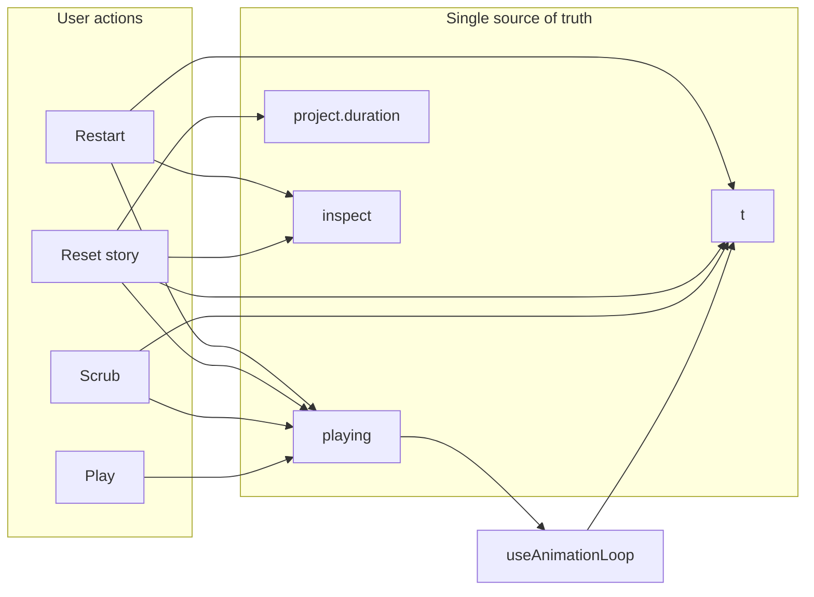

# Production-grade playback and layout polish

## Context (how “video” works today)

The main preview is **not** an HTML5 `<video>` element. Playback is **[`t`](file:///Users/christian/Documents/GitHub/eqVisualiser/src/store.ts) + [`playing`](file:///Users/christian/Documents/GitHub/eqVisualiser/src/store.ts)** in Zustand, advanced by [`useAnimationLoop`](file:///Users/christian/Documents/GitHub/eqVisualiser/src/ui/useAnimationLoop.ts) and rendered in [`App.tsx`](file:///Users/christian/Documents/GitHub/eqVisualiser/src/App.tsx) via `evaluateAtTime` + WebGL. The scrubber is a `<input type="range">` in [`DesktopToolbar.tsx`](file:///Users/christian/Documents/GitHub/eqVisualiser/src/ui/DesktopToolbar.tsx) and [`MobileChrome.tsx`](file:///Users/christian/Documents/GitHub/eqVisualiser/src/ui/MobileChrome.tsx). Export uses a separate canvas path ([`webCodecsVideo.ts`](file:///Users/christian/Documents/GitHub/eqVisualiser/src/export/webCodecsVideo.ts)); it does not drive the live UI.

This matters for requirements: “sync” means **one timeline state** (`t`, `playing`, `project.timeline.duration`) and **no stale inspect/camera** from [`mergeInspectIntoRenderState`](file:///Users/christian/Documents/GitHub/eqVisualiser/src/ui/mergeInspectCamera.ts).

---

## Professional review (seven lenses)

Structured pass over the original plan; items below are **gaps that are now folded into the rest of this document** so implementation does not rediscover them.

1. **Correctness / ordering:** Story reset and timeline reset must happen in a **defined order** so there is no intermediate frame where `playing` is still true with a new `duration`, or `t` is out of range for the new `project`. See **§1.1**.
2. **State single source of truth:** Recommending both “clamp in store” and “`Math.min` in UI” without choosing one invites drift. **Decision:** clamp inside **`setT`** and on **`project` / duration changes** in [`store.ts`](file:///Users/christian/Documents/GitHub/eqVisualiser/src/store.ts); UI reads `t` only (no duplicate clamp logic).
3. **Playback edge cases:** [`useAnimationLoop`](file:///Users/christian/Documents/GitHub/eqVisualiser/src/ui/useAnimationLoop.ts) uses strict `time < duration`; floating-point or timing quirks can theoretically leave `playing === true` with `t` slightly below `duration` while the user expects “ended.” Keep the optional **`playing && t >= duration - ε` guard** or align loop termination with **`>= duration`** in implementation review.
4. **`startRef` vs forced seeks:** [`App.tsx`](file:///Users/christian/Documents/GitHub/eqVisualiser/src/App.tsx) passes `startRef.current` into the hook; ref writes do not re-render. After any **forced** `setT` while paused (Restart, scrub, story reset), the next **Play** already sets `startRef.current = t` in `togglePlay` — good. If implementation ever allows **seek while `playing`**, it must update `startRef` and/or pause first; document that invariant.
5. **Sidebar / focus and a11y:** Collapsing to zero width while focus remains inside the equation field **breaks WCAG** expectations (invisible focused element). When collapsing programmatically, **move focus** to a sensible target (e.g. canvas host with `tabIndex={-1}`, or the sidebar expand control). Use **`inert`** (where supported) or **`aria-hidden` + disabled controls** on the collapsed panel so assistive tech does not traverse off-screen content.
6. **Responsive shell scope:** Centering **only** `.body` while leaving [`.toolbar`](file:///Users/christian/Documents/GitHub/eqVisualiser/src/App.css) full-bleed creates a **split layout** that can feel broken on ultrawide. **Decision:** wrap **toolbar + body** in one constrained shell on **large viewports only** (`min-width: 769px`, aligned with [`useIsMobileLayout`](file:///Users/christian/Documents/GitHub/eqVisualiser/src/ui/useIsMobileLayout.ts)). **Phone / narrow:** do **not** apply `max-width` or extra horizontal inset to the root layout — the stage and overlay chrome must use the **full viewport width** so nothing feels “cut off” at the sides. The existing **bottom-centred** [`MobileChrome`](file:///Users/christian/Documents/GitHub/eqVisualiser/src/ui/MobileChrome.tsx) control strip (Play / Restart / Equation) is the desired pattern; keep that hierarchy and positioning; only use horizontal padding that matches current safe-area / edge spacing, not a centred column that narrows the canvas on phones.
7. **Persistence vs auto-collapse contradiction:** “Remember sidebar preference” and “always collapse on play” conflict unless **precedence** is defined. **Decision (recommended):** `localStorage` stores **manual** expand/collapse only; **auto-collapse on Play and on Reset/Reset story** always runs (maximizes focus when entering playback or clean slate). Initial page load uses stored manual default if present, else **expanded** once for discoverability *or* **collapsed** per product choice — pick one and keep it consistent in code comments.

---

## 1. Reset behavior (timeline + story)

**Recommended product rule (addresses “paused vs autoplay”):** Any explicit **reset** leaves the app in a **paused** state at **`t = 0`**, with the **first frame** shown. That matches current mobile [`onRestart`](file:///Users/christian/Documents/GitHub/eqVisualiser/src/App.tsx) and avoids surprising autoplay after reset.

| Action | Today | Target |
|--------|--------|--------|
| Mobile **Restart** | `setT(0)`, `setPlaying(false)`, `resetInspect()` | Keep; ensure desktop parity |
| **Reset story** (`applyStoryboard`) | Only swaps `project`; leaves `t`, `playing`, and React `inspect` | **Also** pause, `t → 0`, clear inspect (same as Restart), so scrubber and stage match “new story start” |
| **Desktop** | No Restart; story reset only from sidebar | Add **Restart** (and optionally **Reset story** in toolbar menu for parity with mobile ⋯ menu) |

### 1.1 Atomic ordering (avoid one-frame desync)

For **Reset story**, apply updates in this **sequence** (same event turn):

1. **`setPlaying(false)`** — stops [`useAnimationLoop`](file:///Users/christian/Documents/GitHub/eqVisualiser/src/ui/useAnimationLoop.ts) so `t` is not advanced mid-mutation.
2. **Replace `project`** (e.g. `applyStoryboard` in store).
3. **`setT`** to **`0`** (or clamp to new duration if you ever keep non-zero story starts).
4. **`setInspect(resetInspect())`** in React — clears camera offset before the next `renderFrame`.

For **Restart** (timeline only), order **`setPlaying(false)` → `setT(0)` → `resetInspect()`** (project unchanged).

**Export:** Do not allow **Restart / Reset story** to leave export in an inconsistent state; align with existing **`exporting`** disables ([`MobileChrome`](file:///Users/christian/Documents/GitHub/eqVisualiser/src/ui/MobileChrome.tsx)); if export runs against “current project + t,” document whether reset **cancels** or is **blocked** (prefer **blocked** while `exporting` for simplicity).

**Implementation shape (no new concepts):**

- Introduce a small **orchestrator** in [`App.tsx`](file:///Users/christian/Documents/GitHub/eqVisualiser/src/App.tsx) (or a thin helper module): e.g. `resetTimeline()` = `setPlaying(false)` + `setT(0)` + `resetInspect()`; wire mobile `onRestart` and any new desktop control to it.
- Replace raw `applyStoryboard` passed into [`EquationEditor`](file:///Users/christian/Documents/GitHub/eqVisualiser/src/ui/EquationEditor.tsx) / [`EquationSheet`](file:///Users/christian/Documents/GitHub/eqVisualiser/src/ui/EquationSheet.tsx) / [`MobileChrome`](file:///Users/christian/Documents/GitHub/eqVisualiser/src/ui/MobileChrome.tsx) with **`applyStoryboardAndResetTimeline`** that follows **§1.1**. Optionally implement a single **`resetStoryAndTimeline`** action inside [`store.ts`](file:///Users/christian/Documents/GitHub/eqVisualiser/src/store.ts) that performs steps 1–3 atomically, with `App` still owning **inspect** reset (unless you lift inspect to context later).

**Clamp `t` to duration:** Implement in **`setT`** and whenever **`project`** changes (including `setExpression`): `t := clamp(t, 0, project.timeline.duration)`. That keeps `<input type="range">` **`value` ≤ `max`** without a second clamp path in components.

---

## 2. Playback state synchronization

**Root causes of desync already identified:**

- Story reset without resetting `t` / `playing` / inspect.
- `t > duration` after duration changes.
- [`useAnimationLoop`](file:///Users/christian/Documents/GitHub/eqVisualiser/src/ui/useAnimationLoop.ts) depends on `startT` from **`startRef.current` read at render** ([`App.tsx`](file:///Users/christian/Documents/GitHub/eqVisualiser/src/App.tsx)); ref updates do not re-render. This is OK for normal play/scrub flows but fragile if playback continues while `duration` or “logical start” should change. Mitigation: **always pause** on story reset; optionally reset `startRef` when forcing `t` from outside the loop.

**Concrete checks:**

- After natural end (`onEnd` → `setPlaying(false)`), `t` should equal `duration` (existing `Math.min` path). Verify UI shows end state consistently; **Restart** then moves to 0 (already does).
- Scrubber: **`value={t}`** only; **`t`** is always valid via store clamp (§1.1).
- Play button: drive label and any `aria-pressed` strictly from `playing` and `exporting` (disable rules already partially exist).

**Optional hardening:** Add a tiny `useEffect` when `playing && t >= duration` to force pause (belt-and-suspenders if floating-point ever skips `onEnd`).

---

## 3. Sidebar behavior (desktop)

**Today:** Fixed [`aside.sidebar`](file:///Users/christian/Documents/GitHub/eqVisualiser/src/App.css) (~300px); **no** collapse ([`App.tsx`](file:///Users/christian/Documents/GitHub/eqVisualiser/src/App.tsx) only toggles mobile sheet).

**Target:**

- **Collapsible** sidebar: toggle control (chevron or “Equation”) on the divider or toolbar; animate **width** (and padding) with `transition`, **`prefers-reduced-motion: reduce`** respected (pattern already used for mobile chrome in [`App.css`](file:///Users/christian/Documents/GitHub/eqVisualiser/src/App.css)).
- **Auto-collapse** when:
  - User presses **Play** (`playing` false → true), and/or
  - **`resetTimeline`** / **Reset story** runs (same as user wording: “video start or reset”).
- **Persistence:** Use **`localStorage`** for **user-driven** expand/collapse only. **Auto-collapse** on Play and on Reset / Reset story **always** runs (see **seven lenses §7**). Document the rule beside the key.

Collapsed state should **not** break [`EquationEditor`](file:///Users/christian/Documents/GitHub/eqVisualiser/src/ui/EquationEditor.tsx): prefer **mounted + animated width** + `overflow: hidden` so **unapplied drafts** are not destroyed. When auto-collapsing, if **`document.activeElement`** is inside the sidebar, **move focus** to the expand control or the stage host (see **seven lenses §5**).

**Implementation note:** Animating **`width`** can be **janky** on low-end GPUs; acceptable for a narrow panel. If needed, use **`transform: translateX`** for the panel content and a fixed hit target for “expand” instead of animating layout — only if profiling shows layout thrash.

---

## 4. Responsive design (extend mobile-first to large screens)

**Today:** Single breakpoint **768px** ([`useIsMobileLayout.ts`](file:///Users/christian/Documents/GitHub/eqVisualiser/src/ui/useIsMobileLayout.ts), [`App.css`](file:///Users/christian/Documents/GitHub/eqVisualiser/src/App.css)); desktop is full-bleed row (toolbar + sidebar + stage). **Mobile** uses column layout with [`MobileChrome`](file:///Users/christian/Documents/GitHub/eqVisualiser/src/ui/MobileChrome.tsx): top bar, scrub band, and **bottom-centred** primary actions — this layout is **intentional and should be preserved**.

**Target:**

- **Large screens only (`min-width: 769px`):** Add an inner **shell** (new wrapper class) with **`max-width`** (e.g. 1200–1440px range tuned to canvas aspect) and **`margin-inline: auto`**, plus **moderate horizontal padding** so content does not stretch edge-to-edge on ultrawide.
- **Phone / tablet-narrow (`max-width: 768px`):** **No** centred max-width column for the main app — **`width: 100%`** (full bleed) for `.app` / `.body` / `.stageWrap` so the **canvas uses the full device width** and is not visually “cut” or letterboxed by a parent constraint. Do not introduce extra side margins solely for “readability” that would shrink the stage on phones.
- **Mobile chrome:** Keep controls anchored as today: **bottom bar** with **centred / full-width button row** (Play, Restart, Equation) and scrub above it; avoid moving primary actions to a desktop-style top toolbar on small screens.
- **Scope (desktop):** Constrain **toolbar + body together** (see **seven lenses §6**), not body-only, unless you explicitly want a full-bleed top bar.
- **Hierarchy:** Stage remains primary; desktop toolbar stays compact; avoid cluttering desktop with mobile-only patterns (and vice versa).
- **Canvas / WebGL:** [`useWebGLStage`](file:///Users/christian/Documents/GitHub/eqVisualiser/src/ui/useWebGLStage.ts) must still receive correct **drawing buffer size** after layout changes; add a **manual check**: resize window, toggle sidebar (desktop), verify no blank or stretched frame on **both** full-bleed mobile and constrained desktop. If `ResizeObserver` is already used, confirm it tracks the correct host in each layout mode.

**Flaw fixed (original plan):** “min-height” alone is vague — the real risk is **nested flex + min-height: 0** already used in [`.app` / `.body`](file:///Users/christian/Documents/GitHub/eqVisualiser/src/App.css); the shell must preserve **`min-height: 0`** and **`flex: 1`** down to `.stageWrap` so the canvas keeps a defined height.

**Product clarification (this iteration):** If any implementation detail conflicts, **prioritise full-width mobile** and **bottom-centred mobile controls** over a unified centred shell across breakpoints.

---

## 5. UX and accessibility

**Motion / feedback**

- **Reset flash:** short CSS class on [`stageWrap`](file:///Users/christian/Documents/GitHub/eqVisualiser/src/App.css) / `canvasHost` (opacity or border pulse ~150–200ms), skipped when `prefers-reduced-motion` ([`usePrefersReducedMotion`](file:///Users/christian/Documents/GitHub/eqVisualiser/src/ui/usePrefersReducedMotion.ts) already in `App`).
- **Sidebar:** width transition; **mobile** already has opacity/transform on chrome—reuse timing philosophy.

**A11y**

- **Play/Pause:** `aria-label` describing action; consider `aria-pressed={playing}` on a toggle button pattern.
- **Scrubber:** `aria-label` on desktop (mobile already has [`aria-label="Timeline"`](file:///Users/christian/Documents/GitHub/eqVisualiser/src/ui/MobileChrome.tsx)); optional `aria-valuetext` with human-readable time.
- **Restart / Reset story:** visible labels + `aria-label` if icon-only.
- **Focus:** ensure `:focus-visible` styles on `.btn` and range (global focus ring in [`index.css`](file:///Users/christian/Documents/GitHub/eqVisualiser/src/index.css) or `App.css`).

**Keyboard (recommended minimal set)**

- **Space:** play/pause only when **target is not** an editable field: `input`, `textarea`, `select`, or **`contentEditable`**. When focus is on **Play/Pause**, native button behavior already applies — avoid **duplicate** handlers on `document` that fire in addition to the button’s **click** (use `preventDefault` only when the handler owns the action).
- **Home** or **R:** jump to start + pause (same as Restart) with the **same target guards**; **R** is especially risky near equation editing — consider **Shift+Alt+R** or omit **R** if it cannot be made safe globally.
- Optional: small **screen-reader-only** or **aria-live="polite"`** hint on first mount listing shortcuts (avoid noisy live regions on every keypress).

**Note on “Context7”:** If that refers to an external **library-doc MCP** (e.g. Context7), this repo’s enabled MCP list may not include it; validate **React / Zustand / inert** behavior against current docs during implementation. The **seven lenses** section above is the in-repo substitute for a structured external checklist.

---

## 6. Verification checklist (manual)

- Restart / Reset story: **scrubber at 0**, **paused**, **frame matches t=0**, no residual pan/zoom from inspect.
- Play to end: scrubber at end, Pause state; Restart clears end appearance.
- Shorter duration after reset: scrubber not past end; no range `value > max`.
- Desktop: Restart works; sidebar collapses on play/reset with smooth motion (or instant if reduced motion).
- Keyboard: Space toggles play when focus is not in an editor; **R** does not fire while typing in the equation field; focus rings visible.
- Sidebar: after auto-collapse, **no focused element** remains inside an `aria-hidden` / `inert` region.
- Shell: sidebar toggle + window resize do not corrupt canvas aspect or DPR.
- **Mobile:** Stage is **full viewport width** (no horizontal clipping from a max-width shell); bottom chrome remains **usable and centred** as today.

---

## Files likely touched

| Area | Files |
|------|--------|
| Timeline orchestration | [`App.tsx`](file:///Users/christian/Documents/GitHub/eqVisualiser/src/App.tsx), [`store.ts`](file:///Users/christian/Documents/GitHub/eqVisualiser/src/store.ts) |
| Desktop controls | [`DesktopToolbar.tsx`](file:///Users/christian/Documents/GitHub/eqVisualiser/src/ui/DesktopToolbar.tsx) |
| Mobile menu parity | [`MobileChrome.tsx`](file:///Users/christian/Documents/GitHub/eqVisualiser/src/ui/MobileChrome.tsx) (only if resetting behavior changes props) |
| Layout / motion | [`App.css`](file:///Users/christian/Documents/GitHub/eqVisualiser/src/App.css), possibly [`index.css`](file:///Users/christian/Documents/GitHub/eqVisualiser/src/index.css) |
| Optional keyboard | new small hook e.g. `useTimelineKeyboardShortcuts` used from `App.tsx` |

